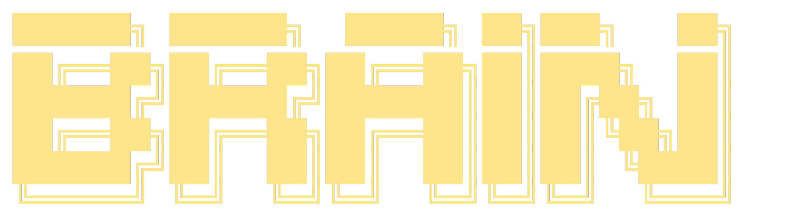
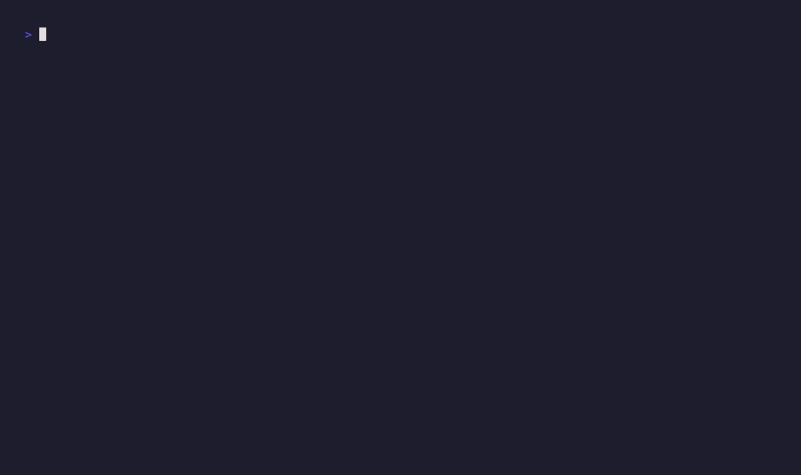

<div align="center">



### Conversational knowledge base over your local notes

[](https://github.com/ugurcan-aytar/brain/actions/workflows/ci.yml)
[](https://codecov.io/gh/ugurcan-aytar/brain)
[](https://go.dev)
[](LICENSE)
[](#requirements)
[](#chat-mode)
[](https://www.anthropic.com)
[](https://github.com/ugurcan-aytar/recall)
[](#contributing)

</div>

---

`brain` turns a folder of markdown and text files into a queryable knowledge base. Ask it a question and it retrieves the most relevant chunks from your notes, then streams a grounded answer with citations back to your terminal. When your notes don't cover the question, it tells you — no hallucinated filler.

It's a **TUI-first app**, not a thin CLI wrapper around an API call. You get an interactive multi-select collection picker, a readline REPL with tab-completion and unique-prefix slash commands, a streaming markdown renderer that colors headings/code/lists live as tokens arrive, mid-response Ctrl+C cancellation, and model/mode pickers you can invoke mid-session. Built on Cobra, [charmbracelet/huh](https://github.com/charmbracelet/huh) (pickers), [charmbracelet/lipgloss](https://github.com/charmbracelet/lipgloss) (styling), and [chzyer/readline](https://github.com/chzyer/readline) (REPL). See [Chat mode](#chat-mode) for the full slash command surface.

## Demo

**One-shot Q&A** — retrieval spinner, streaming markdown answer, cited sources, closing logo:

<p align="center">
  
</p>

**Interactive REPL** — slash commands, `/mode` switching, grounded answer, clean exit:

<p align="center">
  
</p>

**Thinking modes** — same topic asked four different ways. The structure of the response changes with the mode: `recall` → direct answer, `analysis` → findings/connections/gaps, `decision` → frameworks/recommendation, `synthesis` → building blocks/action plan.

<p align="center">
  
</p>

**`/challenge`** — re-score an answer against a different set of sources. brain rebuilds the system prompt around the new chunks and streams a re-grounded response that contrasts the two. Great for stress-testing a conclusion before you commit to it.

<p align="center">
  
</p>

**TUI pickers** — the huh multi-select collection picker that fires on `brain chat` startup, plus the `/model` picker for switching Claude models mid-session:

<p align="center">
  
</p>

**`brain search`** — raw retrieval, no LLM. Lands in a few hundred milliseconds with scored chunks and inline previews. This is what powers the "no context → no LLM → no hallucination" principle:

<p align="center">
  
</p>

**`brain history`** — every answer is archived on disk with model/collections/elapsed metadata. The default list is scriptable; `search` and `view` drill in:

<p align="center">
  
</p>

**`brain history browse`** — interactive TUI picker: `/` fuzzy-filters your past questions, `f` kicks a full-text search across answer bodies, `enter` opens the viewer, `esc` pops back to the list, `d` deletes. Built on `bubbles/list` + `viewport` so it pages, scrolls, and stays out of your scrollback:

<p align="center">
  
</p>

## Table of contents

- [Demo](#demo)
- [Core principle](#core-principle)
- [Features](#features)
- [Requirements](#requirements)
- [Install](#install)
- [Quick start](#quick-start)
- [Commands](#commands)
- [Chat mode](#chat-mode)
- [Thinking modes](#thinking-modes)
- [Configuration](#configuration)
- [Architecture](#architecture)
- [Development](#development)
- [Contributing](#contributing)
- [License](#license)

## Core principle

> **No context → no LLM call → no hallucination.**

Every answer `brain` gives is grounded in chunks retrieved from your own notes. If the retrieval step returns nothing relevant, the LLM call is skipped entirely and you get a clear "nothing found" message instead of a confident-sounding fabrication.

## Features

- **`brain ask "<question>"`** — one-shot Q&A, cited sources, streaming answer
- **`brain chat`** — interactive multi-turn REPL with slash commands, tab completion, and mid-response cancellation
- **`brain search "<query>"`** — raw retrieval, no LLM, for verifying your index; `-n` caps the result count, `--expand` / `--rerank` / `--hyde` / `--explain` mirror the `ask` enhancements so you can tune flags against a concrete output before spending LLM tokens
- **`brain history`** — every Q&A is saved as a timestamped markdown file with model/collections/elapsed metadata; `brain history browse` opens an interactive TUI picker with `/` filter on questions, `f` for full-text search across answers, `enter` to view, `d` to delete
- **`/challenge`** — re-score an answer against a different set of sources to check it
- **Adaptive prompt system** — questions are classified into `recall`, `analysis`, `decision`, or `synthesis` modes, each with a different response structure
- **Full document enrichment** — top results are re-fetched as complete documents so the LLM sees the full source, not just the highest-scoring chunk; long transcripts with detail buried past the intro are handled correctly
- **`brain add --context "description"`** — tells the search engine what a collection is about, dramatically improving retrieval quality for domain-specific content
- **`--index <name>`** (global) — keep multiple isolated knowledge bases under one binary (e.g. `brain --index work` vs `brain --index personal`). Backed by recall's named-index convention at `~/.recall/indexes/<name>.db`
- **`--expand`** — query expansion via recall's local expansion LLM: generates lex/vec query variants (the retriever runs each and merges) and hypothetical passages that can be combined with `--hyde`
- **`--hyde`** — Hypothetical Document Embedding: the LLM produces a short "ideal answer" passage, recall embeds it as if it were a real document, and that vector joins the candidate search as an extra probe
- **`--rerank`** — cross-encoder rerank the top-30 fused candidates via recall's bundled bge-reranker-v2-m3 (continuous 0.0-1.0 relevance score), then blend with RRF rank using the position-aware 75/25 → 60/40 → 40/60 bands
- **`--explain`** — surface a per-chunk score trace (`orig@0 lex1@3 hyde0@1 rerank=0.87`) so you can see why a document landed where it did
- **`--deep` / `/deep`** — post-retrieval LLM chunk filter (20 → 8-10). Independent of `--expand`/`--rerank`/`--hyde`; sits after retrieval and reduces the working set handed to the answer-generation prompt. Combine freely with the recall enhancements.
- **Cross-source tension detection** — the system prompt forces the model to identify disagreements between sources before synthesizing, pushing beyond shallow summary
- **Adaptive scoring** — instead of a hard relevance cutoff that silently drops chunks, brain uses 40% of the top chunk's score as a dynamic floor; on difficult queries where all scores are low, weak-but-best results survive instead of returning "nothing found"
- **Citation verification** — after every answer, `[filename.md]` citations are checked against the retrieved sources; fabricated filenames get a `⚠` warning
- **Prompt caching** — on the Anthropic backend, system directives and conversation history are structured for prompt caching, reducing latency and cost on multi-turn chat sessions
- **`brain doctor`** — checks pipeline health (recall index reachable, embedder loadable, LLM backend configured) and prints actionable fix commands
- **Collection picker** — multi-select UI to scope a question to specific note folders
- **Model switching** — swap between `sonnet` (default), `opus`, and `haiku` mid-session
- **Ctrl+C everywhere** — cancel retrieval or streaming at any time without leaving your terminal in a broken state
- **Pluggable backend** — native Anthropic API, any OpenAI-compatible endpoint (OpenAI, Ollama, OpenRouter, LM Studio, LiteLLM, Groq, Together…), or the local `claude` CLI as a fallback

## Requirements

- **macOS (arm64) or Linux (amd64).** Windows isn't a release target — brain depends on recall's CGo SQLite stack and on llama.cpp's prebuilt llama-server, neither of which we currently build Windows artefacts for.
- **Linux runtime dep:** minimal container bases (ubuntu without `build-essential`, Alpine, …) need `libgomp1` / `libgomp` installed — recall's llama-server subprocess dlopens OpenMP-linked CPU backend plugins. A normal workstation already has it via `gcc`/`g++`.
- **At least one LLM backend.** brain picks the first one it finds, in this order:
  1. `ANTHROPIC_API_KEY` — native Claude API, the fastest and cheapest path (recommended).
  2. `OPENAI_API_KEY` — any OpenAI-compatible endpoint. Works out of the box with OpenAI, and via `OPENAI_BASE_URL` also with Ollama, OpenRouter, LM Studio, LiteLLM, Groq, Together, Fireworks, etc. See [Configuration](#configuration) for examples.
  3. The [Claude Code CLI](https://claude.ai/download) on your PATH — useful if you have a Claude subscription but no API key. Override the binary name with `BRAIN_CLAUDE_BIN` to point at a fork (e.g. `opencode`).
- **Go 1.24+** — only needed if you're building from source.

## Install

### Homebrew (macOS & Linux)

```sh
brew install ugurcan-aytar/brain/brain
```

No `sudo` needed — Homebrew manages its own prefix. Works on macOS (arm64) and on Linux (amd64) via [Linuxbrew](https://docs.brew.sh/Homebrew-on-Linux). Every release auto-publishes a formula to the [homebrew-brain tap](https://github.com/ugurcan-aytar/homebrew-brain).

### One-liner (any POSIX shell)

```sh
curl -sSfL https://raw.githubusercontent.com/ugurcan-aytar/brain/main/install.sh | sh
```

The script downloads the right prebuilt binary for your OS/arch, verifies its SHA-256 against `checksums.txt`, drops it into `/usr/local/bin` (or `~/.local/bin` as a fallback), and runs `brain doctor` at the end to confirm your LLM backend is wired up. Retrieval is handled by the embedded [recall](https://github.com/ugurcan-aytar/recall) library — no Node.js, no npm, no second binary to chase. Local embedding and generation use llama.cpp's official `llama-server` prebuilt as a subprocess (auto-downloaded by recall on first use, lives in `~/.recall/bin/llamacpp/`).

Environment overrides: `BRAIN_VERSION=v1.2.3` to pin a release, `BRAIN_PREFIX=$HOME/.local` to change the install prefix.

### From source

```sh
git clone https://github.com/ugurcan-aytar/brain.git
cd brain
go build -o brain ./cmd/brain
sudo mv brain /usr/local/bin/
```

### With `go install`

```sh
go install github.com/ugurcan-aytar/brain/cmd/brain@latest
```

After any install path, run `brain doctor` to check that the index is reachable and a Claude (or other) backend is wired up.

## Quick start

Kick the tires against the included sample notes:

```sh
# 1. Register the example notes folder (auto-runs `brain index` afterward)
brain add ./examples --name examples

# 2. Ask a question
brain ask "What did the team decide about authentication?"

# 3. Or start an interactive conversation
brain chat
```

Point `brain add` at your own folder when you're ready — `~/Documents/my-notes`,
`~/Obsidian/vault`, whatever. The [`examples/`](examples/) directory ships
three small markdown files (meeting notes, a technical doc, a journal
entry) chosen to show off retrieval, cross-source connections, and
thinking-mode responses on a realistic tiny corpus.

## Commands

### Query

| Command | Description |
|---|---|
| `brain ask "<question>"` | One-shot Q&A with cited sources |
| `brain chat` | Interactive multi-turn conversation |
| `brain search "<query>"` | Raw retrieval results (no LLM) |

**Global flag (works on every subcommand):**

- `--index <name>` — use a named isolated recall index at `~/.recall/indexes/<name>.db` instead of the default DB. Lets you keep e.g. `brain --index work …` separated from `brain --index personal …` under one binary. Ignored (with a warning) when `$RECALL_DB_PATH` is set.

**Flags on `ask`:**

- `-c, --collection <name>` — scope to a single collection (skips the picker)
- `-m, --model <model>` — `sonnet` (default), `opus`, `haiku`, or a full Anthropic model ID
- `-M, --mode <mode>` — override the auto-detected thinking mode: `auto`, `recall`, `analysis`, `decision`, `synthesis`
- `-n, --top <int>` — candidate count (default: config `TopK`)
- `--expand` — query expansion (lex/vec variants + HyDE passages); costs a one-shot expansion-LLM call
- `--rerank` — cross-encoder rerank the top-30 via recall's bge-reranker-v2-m3; continuous 0-1 scores blended with RRF rank
- `--hyde` — Hypothetical Document Embedding: LLM-generated answer passages embedded as extra vector probes
- `--explain` — print a per-chunk score trace (which variant hit it, reranker score)
- `--deep` — post-retrieval LLM chunk filter (20 → 8-10). Independent of the three flags above; combinable.

**Flags on `search`:** same as `ask` minus the LLM-specific ones (`-m`, `-M`, `--deep`). `--index` works here too (it's global).

**Flags on `chat`:**

- `-c, --collection <name>` — scope the whole session to one collection (skips the startup picker)
- `-m, --model <model>` — same model aliases as `ask`; can also be swapped mid-session with `/model`

### Collections

| Command | Description |
|---|---|
| `brain add <path>` | Register a folder as a collection (runs `brain index` after) |
| `brain remove <name>` | Remove a collection and clean up its embeddings |
| `brain collections` | List registered collections |
| `brain files [-c name]` | List indexed files, optionally filtered by collection |

**Flags on `add`:**

- `--name <name>` — override the default collection name (folder basename)
- `--mask <glob>` — override the default file glob (`**/*.{txt,md}`)
- `--context <description>` — describe what this collection contains (e.g. `"Podcast transcripts about product management"`); improves search quality significantly

### History

Every answer is archived as a timestamped markdown file (default `~/.brain/history`, overridable via `BRAIN_HISTORY_DIR`). Each file captures the question, answer, sources, *and* the mode, model, collections, and elapsed time. Browse from the terminal:

| Command | Description |
|---|---|
| `brain history` | List the 10 most recent entries, newest first |
| `brain history browse` | Interactive TUI picker — `/` to filter by question, `f` to full-text search bodies, `enter` to view, `d` to delete, `esc` back |
| `brain history search <query>` | Non-interactive full-text search |
| `brain history view <id>` | Render an entry (id from the list, 1-based) |
| `brain history rm <id>` | Delete an entry |
| `brain history path` | Print the history directory path |

**Flags on `history`:**

- `-n, --limit <N>` — number of entries to show in the default list (default `10`)

### Maintenance

| Command | Description |
|---|---|
| `brain index` | Re-scan files and regenerate embeddings |
| `brain status` | Show index health and brain config |
| `brain doctor` | Verify recall index + embedder + LLM backend are wired up |

## Chat mode

`brain chat` is a full REPL with slash commands, rolling conversation history, and Tab-to-complete.

| Slash command | Description |
|---|---|
| `/help` | Show command list and current model/mode/collections |
| `/mode [name]` | View or change thinking mode (`auto`, `recall`, `analysis`, `decision`, `synthesis`) |
| `/model [name]` | View or switch Claude model; bare `/model` opens a picker |
| `/collections` | Re-run the collection picker |
| `/sources` | Show the sources from the last answer |
| `/challenge` | Re-score the last Q&A against a different set of collections |
| `/clear` | Reset conversation history |
| `/quit` | Exit chat (also: `Ctrl+C` twice) |

Slash commands support unique-prefix matching: typing `/col` resolves to `/collections`. Tab auto-completes partial commands.

Press `Ctrl+C` once during streaming to cancel the in-flight request. Press it twice within two seconds on an empty prompt to exit.

## Thinking modes

Every question gets a system prompt with one of four response structures. Auto-classification picks one based on regex heuristics (English + Turkish), or you can force one with `-M` / `/mode`.

| Mode | Trigger examples | Response structure |
|---|---|---|
| **recall** | "what did my notes say about…", "list…", "what is…" | **Direct answer** → **Related context** |
| **analysis** | "why…", "compare…", "how does X relate to Y", "explain…" | **Key findings** → **Connections** → **Gaps** → **Synthesis** |
| **decision** | "should I…", "pros and cons", "recommend…", "worth it" | **Relevant frameworks** → **Arguments** → **Blind spots** → **Recommendation** |
| **synthesis** | "plan…", "how can I build/scale/launch…", "roadmap" | **Building blocks** → **Integration** → **Action plan** → **Assumptions & gaps** |

Analysis is the default when nothing matches — it's the most generally useful.

## Configuration

Defaults live in [`internal/config/config.go`](internal/config/config.go). The interesting knobs:

| Setting | Default | Purpose |
|---|---|---|
| `Model` | `claude-sonnet-4-6` | Default Claude model |
| `MaxTokens` | `16384` | Response length cap |
| `TopK` | `20` | Chunks to retrieve per question |
| `MinScore` | `0.05` | Minimum relevance floor (adaptive filter uses 40% of top score) |
| `MinChunksToCallLLM` | `1` | Grounding gate threshold |
| `MaxConversationTurns` | `10` | Chat history cap (user + assistant per turn) |
| `DefaultMask` | `**/*.{txt,md}` | Files to index when adding a collection |

**Environment variables:**

| Variable | Purpose |
|---|---|
| `ANTHROPIC_API_KEY` | Use the native Anthropic API (highest priority backend) |
| `OPENAI_API_KEY` | Use any OpenAI-compatible `/v1/chat/completions` endpoint |
| `OPENAI_BASE_URL` | Override the OpenAI endpoint — point this at Ollama, OpenRouter, LM Studio, LiteLLM, etc. Defaults to `https://api.openai.com/v1` |
| `OPENAI_MODEL` | Model name to send to the OpenAI-compatible endpoint. Defaults to `gpt-4o`. Also honors `-m` / `/model` when the value doesn't look like a Claude alias, so `brain ask -m llama3.1 "…"` works on Ollama |
| `BRAIN_CLAUDE_BIN` | Name of the Claude CLI binary brain shells out to. Defaults to `claude`. Set to `opencode` (or another fork that speaks the same `stream-json` protocol) to reuse the CLI fallback without rebuilding |
| `BRAIN_HISTORY_DIR` | Override where Q&A history is written (defaults to `~/.brain/history`) |

### Using a different backend

**Ollama (local, free, offline-capable):**

```sh
export OPENAI_API_KEY=ollama          # any non-empty string works
export OPENAI_BASE_URL=http://localhost:11434/v1
export OPENAI_MODEL=llama3.1
brain ask "what did I write about activation energy?"
```

**OpenRouter (one key, every model):**

```sh
export OPENAI_API_KEY=sk-or-…
export OPENAI_BASE_URL=https://openrouter.ai/api/v1
brain ask -m meta-llama/llama-3.1-70b-instruct "…"
```

**OpenAI proper:**

```sh
export OPENAI_API_KEY=sk-…
brain ask "…"                         # uses gpt-4o by default
```

**`opencode` instead of `claude`:**

```sh
export BRAIN_CLAUDE_BIN=opencode
brain ask "…"
```

> **Note:** brain's adaptive prompts and thinking-mode directives are tuned for Claude. Non-Claude models will work — the retrieval gate ("no chunks → no LLM call") is model-agnostic — but response quality, especially for `synthesis` and `decision` modes, varies. Multi-query expansion, citation verification, adaptive scoring, and TopK 20 work on **all** backends. Prompt caching is Anthropic-only (OpenAI auto-caches shared prefixes without explicit markup). Run `brain doctor` to see which backend is active.

## Architecture

```
cmd/brain/            # Cobra entry point + subcommand wiring
internal/
├── config/           # runtime defaults (model, TopK, min-score, mask)
├── engine/           # recall.Engine + embedder lifecycle wrapper
├── retriever/        # adaptive filter, grounding gate, full-doc enrichment, deep filter
├── prompt/           # query classifier + adaptive system prompt builder (static/dynamic split for caching)
├── llm/              # Anthropic REST/SSE (prompt caching), OpenAI-compat, claude CLI fallback
├── markdown/         # streaming terminal markdown renderer
├── history/          # timestamped Q&A archive
├── picker/           # interactive collection multi-select (charmbracelet/huh)
├── ui/               # logo, colors, source bars (charmbracelet/lipgloss)
└── commands/         # one file per CLI subcommand
```

Retrieval is powered by [recall](https://github.com/ugurcan-aytar/recall),
brain's sibling search engine. brain imports it as a Go library
(`pkg/recall`) — there's no subprocess, no separate binary, no second
install step. recall in turn was inspired by [qmd](https://github.com/tobi/qmd)
by Tobi Lütke, which brain used to shell out to in earlier versions.

### Retrieval → grounding → synthesis

```
question ──▶ [--expand] expansion LLM → lex / vec / hyde variants
         ──▶ recall hybrid search (BM25 + vector + RRF fusion) for the
             original query + every lex/vec variant, merged by docid
         ──▶ [--hyde] embed each hypothetical passage → extra vector probe,
             merged into the same pool
         ──▶ [--rerank] cross-encoder rerank the top-30 (bge-reranker-v2-m3)
             → min-max normalise logits → position-aware blend with RRF rank
             (top-3: 75/25, ranks 4-10: 60/40, ranks 11+: 40/60)
         ──▶ adaptive min-score filter (40% of top score)
         ──▶ grounding gate (skip LLM if no chunks)
         ──▶ enrich top results with full documents (recall.Engine.Get)
         ──▶ [--deep] post-retrieval LLM chunk filter (20 → 8-10)
         ──▶ classify query → pick mode directive
         ──▶ build adaptive system prompt (static/dynamic split)
         ──▶ stream response (prompt-cached on Anthropic)
         ──▶ verify citations against retrieved set
         ──▶ print sources + save history with metadata
```

All bracketed stages are opt-in flags. With none of them set the pipeline
is a plain BM25 + vector + RRF hybrid — no subprocess boot, no extra
LLM call beyond the final synthesis.

### Why recall as a library?

[recall](https://github.com/ugurcan-aytar/recall) is a Go search
engine (BM25 via SQLite FTS5, vector via sqlite-vec, RRF fusion,
cross-encoder reranker, query expansion, HyDE) purpose-built to be
imported, not shelled out to. brain links it directly: one binary
for the retrieval primitives, typed return values, no cross-tool
JSON contract to keep in sync, no separate server to install or keep
running. Local embedding and generation run through recall's
llama.cpp-subprocess backend (auto-downloaded on first use, lives
under `~/.recall/bin/llamacpp/`) — no build tags, no CGo on the
inference hot path, fully offline once the model + llama-server
prebuilt are cached locally.

Earlier brain versions (v0.2.x) shelled out to [qmd](https://github.com/tobi/qmd),
a Node.js retrieval engine. That migration motivated recall's
library-first design — the friction of requiring Node + npm alongside
brain, the per-query subprocess overhead, and the JSON-over-stdin
contract all went away once retrieval moved in-process.

### Why direct HTTP instead of the Anthropic SDK?

The official Go SDK is still in beta and its public API shape changes across minor releases. The REST + SSE surface is stable and documented, so we talk to `api.anthropic.com` directly with `net/http`. ~200 lines, no dependencies, no version churn. The direct HTTP approach also lets us use content-block arrays with `cache_control` breakpoints for prompt caching — something the SDK doesn't always expose cleanly.

## Development

```sh
# Build
go build ./...

# Run the full test suite
go test ./...

# Smoke test the binary
./brain --help
```

Each package that has non-trivial logic ships with its own `_test.go` file — see `internal/config`, `internal/retriever`, `internal/prompt`, `internal/llm`, `internal/markdown`, and `internal/history`.

## Contributing

PRs welcome. The code is deliberately straightforward — one file per command, one responsibility per package, no clever abstractions. Please keep it that way.

Before opening a PR:

1. `go build ./...` must succeed.
2. `go test ./...` must pass.
3. New behavior should come with a test.

## Credits

brain's retrieval layer is powered by [recall](https://github.com/ugurcan-aytar/recall), a local-first hybrid search engine. recall's architecture was originally inspired by [qmd](https://github.com/tobi/qmd) by Tobi Lütke.

What recall brings to brain:

- **BM25 + vector + RRF hybrid fusion** — single Go binary, zero runtime dependencies
- **Local GGUF embedding** via [nomic-embed-text-v1.5](https://huggingface.co/nomic-ai/nomic-embed-text-v1.5) (~146 MB, Apache 2.0, 768-dim), served through llama.cpp's `llama-server` subprocess
- **Cross-encoder reranking** via [bge-reranker-v2-m3](https://huggingface.co/BAAI/bge-reranker-v2-m3) (continuous 0.0-1.0 scoring through llama-server's `/v1/rerank`) blended with RRF rank by position-aware bands
- **Query expansion** via [qmd-query-expansion-1.7B](https://huggingface.co/tobil/qmd-query-expansion-1.7B-gguf) (parallel multi-query search: lex + vec variants merged by docid)
- **HyDE** — hypothetical document embedding: the LLM writes an "ideal answer," recall embeds it as a document and adds that vector as an extra probe
- **Smart markdown chunking** (900 estimated tokens, break-point scoring) + **AST-aware code chunking** via [tree-sitter](https://github.com/smacker/go-tree-sitter) for Go, Python, TypeScript, Java, Rust
- **Incremental embedding** — only modified chunks are re-embedded; `chunks.content_hash` gates the re-run
- **Adaptive min-score floor** — 40% of the top result's score as a dynamic threshold, so noisy queries degrade gracefully instead of silently dropping the best available result

The LLM layer is pluggable. brain talks directly to the [Anthropic REST API](https://docs.anthropic.com/en/api/) (native streaming + prompt caching — no SDK dependency), to any [OpenAI-compatible endpoint](https://platform.openai.com/docs/api-reference) (OpenAI proper, Ollama, OpenRouter, LM Studio, LiteLLM, Groq, Together, Fireworks — wired through `OPENAI_API_KEY` + `OPENAI_BASE_URL`), and to the [Claude Code CLI](https://claude.ai/download) when neither API key is set (override the binary name with `BRAIN_CLAUDE_BIN` to point at a fork like `opencode`). Prompt caching only activates on the Anthropic native path; the other two backends stream responses without caching. See **Configuration → Using a different backend** for concrete examples.

The terminal UI is built on [charmbracelet/huh](https://github.com/charmbracelet/huh) (pickers), [charmbracelet/lipgloss](https://github.com/charmbracelet/lipgloss) (styling), and [chzyer/readline](https://github.com/chzyer/readline) (REPL).

## License

MIT. See [LICENSE](LICENSE).
